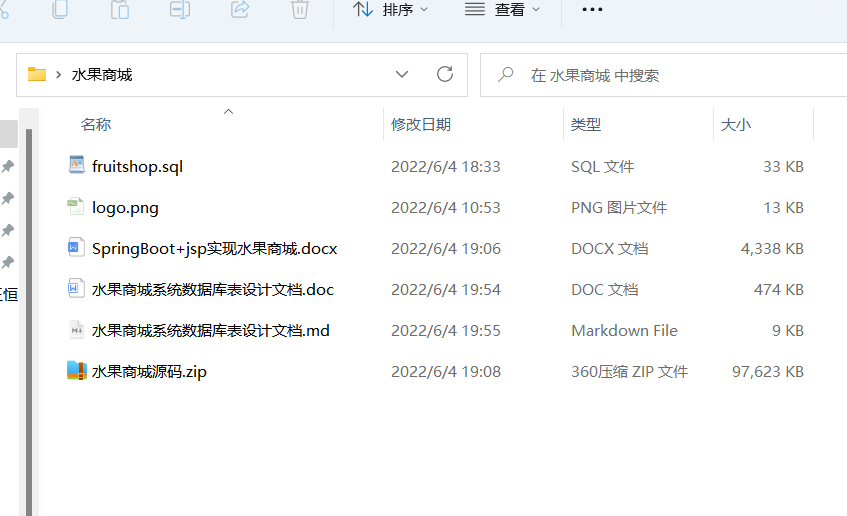

# SpringBoot+jsp实现水果商城系统（含源码+数据库+文档）

#### 介绍
这是一个基于SpringBoot+JSP+Mybatsi实现水果商城系统。

#### 软件架构
|||
|-|-|
|用途|工具名|
|代码编写工具|IDEA 2021.1.1 x64|
|服务器|apache-tomcat-8.5.71（端口：8080）|
|Java环境|JDK-1.8|
|部署工具|apache-maven-3.5.3|
|浏览器|Google Chrome|


#### 使用说明

1.  该项目只开源了源代码，相关的word文档+mysql数据库请在csdn下载：https://download.csdn.net/download/weixin_44385486/85546809
2.  管理员登录地址：http://localhost:8081/test1_war_exploded/login/login
3.  商城首页：http://localhost:8081/test1_war_exploded/login/uIndex

# 一、前言

今天是2022年6月3日，端午节，接到一位同学的投稿，说需要做一个课程设计，用SpringBoot做一个水果商城系统，我在网上找了一下，只有我去年12月份实现了一个简单的SpringBoot的水果商城，但是同学反馈，这个太简单了，他的课程设计实现水果商城需要5张表以上的水果商城，所以我在端午期间实现了这个SpringBoot+jsp的水果商城系统


本系统旨在提供一个方便、快捷的网上水果商城系统，在如今信息化的时代，实体的水果商店弊端展现出来，水果种类数目少，难以预测水果的销量以此来确定进货量，并且不能对每月的销售数据进行良好的统计。因此，本商城系统给用户提供了一个良好的购物选择页面，用户可以浏览各种商品，查看商品的实物图和其他购买用户的评价来考虑是否购买，同时用户可以在下单后，随时查看订单的状态，也可以在几个月后查看自己的购买记录。对于商家，可以根据后台数据对用户的喜好进行判断，以此来预测进货量，以及可以随时在网站上发布各种消息，与用户交流非常方便。通过本系统，可以为顾客和商家带来一个满足基本需求的网上交易平台。

# 二、开发工具及实现环境

|        |                               |
| ------ | ----------------------------- |
| 用途     | 工具名                           |
| 代码编写工具 | IDEA 2021.1.1 x64             |
| 服务器    | apache-tomcat-8.5.71（端口：8080） |
| Java环境 | JDK-1.8                       |
| 部署工具   | apache-maven-3.5.3            |
| 浏览器    | Google Chrome                 |

*   项目结构


# 三、系统需求分析

### 1、 功能概述

本系统可以提供一个真实的网上购物流程，包括商品浏览、添加商品到购物车、收藏商品、支付并查看购买商品的订单状态，在完成收获后可以对商品进行评价。同时管理员可以进入后台管理系统对用户的订单进行处理，包括发货、更改订单信息等。还可以对商城里面的商品进行处理，包括上架、下架和修改商品的信息。也能对用户的信息进行查找。该系统可以满足基本的一个商品交易平台。

### 2、系统数据流图

*   水果商城系统中“商品交易”流程图


*   商城系统中“管理”流程图


### 3、系统数据字典

#### （1）商品信息

*   “商品信息”数据结构

    ①名字：商品信息

    ②别名：商品详细信息

    ③描述：管理员编辑商品信息，上架、下架商品。

    ④定义：商品信息 = 编号 + 名称 + 价格 + 收藏数 + 购买量 + 描述图1 + 描述图2 + 描述图3 + 描述图4 + 文字描述

    ⑤位置：保存至商品信息表

*   “商品信息”数据结构之数据项

表2-1 “编号”数据项

|    |              |
| -- | ------------ |
| 名字 | 编号           |
| 别名 | 顺序号          |
| 描述 | 唯一标识某商品的数字编号 |
| 定义 | 整型数          |
| 位置 | 商品信息表、订单明细表  |

表2-2 “名称”数据项

|    |             |
| -- | ----------- |
| 名字 | 名称          |
| 别名 | 商品的名称       |
| 描述 | 商品的名称       |
| 定义 | 字符型         |
| 位置 | 商品信息表、订单明细表 |

表2-3 “价格”数据项

|    |             |
| -- | ----------- |
| 名字 | 价格          |
| 别名 | 商品的价格       |
| 描述 | 商品的价格       |
| 定义 | 字符型         |
| 位置 | 商品信息表、订单明细表 |

表2-4 “收藏数”数据项

|    |             |
| -- | ----------- |
| 名字 | 收藏数         |
| 别名 | 商品的收藏数      |
| 描述 | 商品的收藏数      |
| 定义 | 整数型         |
| 位置 | 商品信息表、订单明细表 |

表2-5 “购买量”数据项

|    |             |
| -- | ----------- |
| 名字 | 购买量         |
| 别名 | 商品的购买量      |
| 描述 | 商品的购买量      |
| 定义 | 整数型         |
| 位置 | 商品信息表、订单明细表 |

表2-6 “描述图1”数据项

|    |             |
| -- | ----------- |
| 名字 | 描述图1        |
| 别名 | 商品的描述图1     |
| 描述 | 商品的描述图      |
| 定义 | 字符型         |
| 位置 | 商品信息表、订单明细表 |

表2-7 “描述图2”数据项

|    |             |
| -- | ----------- |
| 名字 | 描述图2        |
| 别名 | 商品的描述图2     |
| 描述 | 商品的描述图      |
| 定义 | 字符型         |
| 位置 | 商品信息表、订单明细表 |

表2-8 “描述图3”数据项

|    |             |
| -- | ----------- |
| 名字 | 描述图3        |
| 别名 | 商品的描述图3     |
| 描述 | 商品的描述图      |
| 定义 | 字符型         |
| 位置 | 商品信息表、订单明细表 |

表2-9 “描述图4”数据项

|    |             |
| -- | ----------- |
| 名字 | 描述图4        |
| 别名 | 商品的描述图      |
| 描述 | 商品的描述图      |
| 定义 | 字符型         |
| 位置 | 商品信息表、订单明细表 |

表2-10 “文字描述”数据项

|    |             |
| -- | ----------- |
| 名字 | 文字描述        |
| 别名 | 商品的文字描述     |
| 描述 | 商品的文字描述     |
| 定义 | 文本型         |
| 位置 | 商品信息表、订单明细表 |

*   数据流

流名：商品信息数据流

说明：“商品信息”数据结构在系统的流向

数据流来源：管理员创建、修改商品事务

平均流量：每天几十次

高峰期：每天上百次

*   数据存储

&#x20;    ① 数据库存储名：商品信息表

② 说明：商品信息数据，用于用户和管理员进行查看等操作。

③ 编号：商品信息为唯一标识，顺序整数，从1开始每次增加1。

④ 输入的数据流：创建和修改商品的数据流，来自管理员创建和修改商品。

⑤ 输出的数据流：查找商品的数据流，用于用户和管理员查看商品的相关信息。

⑥ 数据结构：“商品信息”“商品种类信息”

⑦ 数据量：一天，100 X 80 = 8 000字节。

⑧ 存取频度：每小时存取更新 12\~18次，查询大于等于80次。

⑨ 存取方式：顺序插入、联机处理、检索与更新、顺序检索与随机检索。

*   数据处理

    ① 处理过程名：实时商品分类查找

    ② 说明：根据外部提供的所要查找的商品种类名称，要能够实时的查找该种类的全部商品。

    ③ 输入：商品种类的名称。

    ④ 输出：属于该商品种类的全部商品。

    ⑤ 处理：通过数据库引擎先从商品种类信息表中查找当前种类名称所对应的种类编号，然后到商品信息表中根据商品种类编号等于刚刚查找到的商品种类编号来进行精确查找。

#### （2）订单信息

*   “订单信息”数据结构

    ①名字：订单信息

    ②别名：订单详细信息

    ③描述：管理员根据订单信息进行发货

    ④定义：订单信息 = 订单编号 + 商品编号 + 用户编号 + 订单号 + 订单生成时间+ 总金额 + 订单状态 + 订单总数

    ⑤位置：保存至订单信息表

*   “订单信息”数据结构之数据项

表2-11 “订单编号”数据项

|    |              |
| -- | ------------ |
| 名字 | 订单编号         |
| 别名 | 订单编号         |
| 描述 | 唯一标识某订单的数字编号 |
| 定义 | 整型数          |
| 位置 | 商品信息表、订单明细表  |

表2-12 “商品编号”数据项

|    |              |
| -- | ------------ |
| 名字 | 商品编号         |
| 别名 | 商品的编号        |
| 描述 | 唯一标识某商品的数字编号 |
| 定义 | 整数型          |
| 位置 | 商品信息表、订单明细表  |

表2-13 “用户编号”数据项

|    |              |
| -- | ------------ |
| 名字 | 用户编号         |
| 别名 | 用户的编号        |
| 描述 | 唯一标识某用户的数字编号 |
| 定义 | 整数型          |
| 位置 | 商品信息表、订单明细表  |

表2-14 “订单号”数据项

|    |             |
| -- | ----------- |
| 名字 | 订单号         |
| 别名 | 订单号         |
| 描述 | 用户购买生成的订单号  |
| 定义 | 字符型         |
| 位置 | 商品信息表、订单明细表 |

表2-15 “订单生成时间”数据项

|    |               |
| -- | ------------- |
| 名字 | 订单生成时间        |
| 别名 | 订单生成时间        |
| 描述 | 用户购买商品是订单生成时间 |
| 定义 | 字符型           |
| 位置 | 商品信息表、订单明细表   |

表2-16 “总金额”数据项

|    |             |
| -- | ----------- |
| 名字 | 总金额         |
| 别名 | 总金额         |
| 描述 | 订单一共需要的金额   |
| 定义 | 字符型         |
| 位置 | 商品信息表、订单明细表 |

表2-17 “订单状态”数据项

|    |             |
| -- | ----------- |
| 名字 | 订单状态        |
| 别名 | 订单生成时间      |
| 描述 | 订单是否被删除     |
| 定义 | 字符型         |
| 位置 | 商品信息表、订单明细表 |

表2-18 “订单总数”数据项

|    |             |
| -- | ----------- |
| 名字 | 订单总数        |
| 别名 | 订单总数        |
| 描述 | 某用户一共生成的订单数 |
| 定义 | 字符型         |
| 位置 | 商品信息表、订单明细表 |

*   数据流

    数据流名：订单信息数据流

    说明：“订单信息”数据结构在系统的流向

    数据流来源：用户购买商品生成

    平均流量：每天二百次次

    高峰期：每天五百次次

*   数据存储

    ① 数据库存储名：订单信息表

    ② 说明：订单信息数据

    ③ 编号：订单信息为唯一标识，顺序整数，从1开始每次增加1。

    ④ 输入的数据流：来自用户购买商品生成。

    ⑤ 输出的数据流：用于管理员根据订单发货

    ⑥ 数据结构：“订单信息”

    ⑦ 数据量：一天，200 X 80 = 16 000字节。

    ⑧ 存取频度：每小时存取更新 12\~18次，查询大于等于80次。

    ⑨ 存取方式：顺序插入、联机处理、检索与更新、顺序检索与随机检索。

*   数据处理

&#x20;   ① 处理过程名：实时订单分类查找

② 说明：根据外部提供的所要查找的订单编号等信息，要能够实时的查找该订单

③ 输入：订单编号、用户编号。

④ 输出：属于改类下的所有订单

⑤ 处理：通过数据库引擎先从订单信息表中查找当前订单所对应的订单编号，然后到订单信息表中根据订单编号等于刚刚查找到的订单编号来进行精确查找。

#### （3）用户信息

*   “用户信息”数据结构

    ①名字：用户信息

    ②别名：用户详细信息

    ③描述：管理员对用户的注册、登录和密码修改进行管理

    ④定义：用户信息 = 用户编号 + 用户名 + 密码 + 手机号 + 真实名称 + 性别 + 地址 + 邮件

    ⑤位置：保存至用户信息表

*   “用户信息”数据结构之数据项

表2-19 “用户编号”数据项

|    |                   |
| -- | ----------------- |
| 名字 | 编号                |
| 别名 | 顺序号               |
| 描述 | 唯一标识某用户的数字编号      |
| 定义 | 整型数               |
| 位置 | 商品信息表、订单明细表、用户信息表 |

表2-20 “用户名”数据项

|    |                   |
| -- | ----------------- |
| 名字 | 用户名               |
| 别名 | 用户的名称             |
| 描述 | 用户的名称             |
| 定义 | 字符型               |
| 位置 | 商品信息表、订单明细表、用户信息表 |

表2-21 “密码”数据项

|    |                   |
| -- | ----------------- |
| 名字 | 密码                |
| 别名 | 密码                |
| 描述 | 用户的登录密码           |
| 定义 | 字符型               |
| 位置 | 商品信息表、订单明细表、用户信息表 |

表2-22 “手机号”数据项

|    |                   |
| -- | ----------------- |
| 名字 | 手机号               |
| 别名 | 手机号               |
| 描述 | 用户的手机号            |
| 定义 | 字符型               |
| 位置 | 商品信息表、订单明细表、用户信息表 |

表2-23 “真实姓名”数据项

|    |                   |
| -- | ----------------- |
| 名字 | 真实姓名              |
| 别名 | 真实姓名              |
| 描述 | 用户的真实姓名           |
| 定义 | 字符型               |
| 位置 | 商品信息表、订单明细表、用户信息表 |

表2-24 “性别”数据项

|    |                   |
| -- | ----------------- |
| 名字 | 性别                |
| 别名 | 性别                |
| 描述 | 用户的性别             |
| 定义 | 字符型               |
| 位置 | 商品信息表、订单明细表、用户信息表 |

表2-25 “地址”数据项

|    |                   |
| -- | ----------------- |
| 名字 | 地址                |
| 别名 | 地址                |
| 描述 | 用户的地址             |
| 定义 | 字符型               |
| 位置 | 商品信息表、订单明细表、用户信息表 |

表2-26 “邮件”数据项

|    |                   |
| -- | ----------------- |
| 名字 | 邮件                |
| 别名 | 邮件                |
| 描述 | 用户的邮件             |
| 定义 | 字符型               |
| 位置 | 商品信息表、订单明细表、用户信息表 |

*   数据流

    数据流名：用户信息数据流

    说明：“用户信息”数据结构在系统的流向

    数据流来源：用户登录、注册和修改个人信息。

    平均流量：每天几十次

    高峰期：每天上百次

*   数据存储

    ① 数据库存储名：用户信息表

    ② 说明：用户信息数据，用于用户修改和管理员查看用户信息。

    ③ 编号：用户编号为唯一标识，顺序整数，从1开始每次增加1。

    ④ 输入的数据流：来自用户创建和修改商品。

    ⑤ 输出的数据流：用于用户和管理员查看用户的相关信息。

    ⑥ 数据结构：“用户信息”

    ⑦ 数据量：一天，100 X 80 = 8 000字节。

    ⑧ 存取频度：每小时存取更新 12\~18次，查询大于等于80次。

    ⑨ 存取方式：顺序插入、联机处理、检索与更新、顺序检索与随机检索。

*   数据处理

    ① 处理过程名：实时用户分类查找

    ② 说明：根据外部提供的所要查找的用户名称，要能够实时的查找到目标用户

    ③ 输入：用户的名称。

    ④ 输出：属于该用户的信息

    ⑤ 处理：通过数据库引擎先从用户信息表中查找当前名称所对应的用户编号，然后在用信息表中根据用户编号等于刚刚查找到的用户编号来进行精确查找。

### 4、系统功能分析

*   网站总模块图


*   网站用户端页面结构


### 5、系统设计

#### （1）系统E-R图


#### （2）数据库逻辑结构设计

按照E-R图到逻辑关系模式的转换规则和根据系统的数据库分表优化，可得到系统有如下8个关系，其中带下划线的为关系关键字（即主码）。

（1） 用户信息（用户编号，姓名，电话，邮箱，状态，地址，昵称，密码，创建时间，最后登录时间）

（2） 管理员信息（管理员编号，姓名，电话，密码，权限）

（3） 商品种类信息（顺编号，种类名称）

（4） 商品信息（商品编号，名称，种类编号，价格，库存，图片，简介，详细介绍，销量，创建时间，更新时间，状态，上架时间）

（5） 订单信息（订单编号，用户编号，状态，商品数量，商品总价，运单号，创建时间，更新时间）

（6） 订单明细信息（订单明细编号，订单编号，商品编号，商品名称，商品价格，商品数量）

（7） 订单处理记录信息（顺序号，订单编号，管理者编号，更新后状态，时间）

（8） 评价信息（顺序号，订单明细编号，星级，内容，图片，时间）

#### （3）数据库物理结构设计及实现

**数据库名：** fruitshop

**文档版本：** V1.0.0

**文档描述：** 水果商城系统数据库表设计描述

| 表名                                               | 说明                    |
| ------------------------------------------------ | --------------------- |
| [car](#car "car")                                | 购物车表（car）             |
| [comment](#comment "comment")                    | 评论表（comment）          |
| [item](#item "item")                             | 商品信息表（item）           |
| [item\_category](#item_category "item_category") | 商品类目表（item\_category） |
| [item\_order](#item_order "item_order")          | 订单表（item\_order）      |
| [manage](#manage "manage")                       | 管理员表（manage）          |
| [message](#message "message")                    | 留言表（message）          |
| [news](#news "news")                             | 公告表（news）             |
| [order\_detail](#order_detail "order_detail")    | 订单细节表（order\_detail）  |
| [sc](#sc "sc")                                   | 收藏表（sc）               |
| [user](#user "user")                             | 用户表（user）             |

**表名：** car

**说明：**

**数据列：**

| 序号 | 名称       | 数据类型    | 长度  | 小数位 | 允许空值 | 主键 | 默认值 | 说明 |
| -- | -------- | ------- | --- | --- | ---- | -- | --- | -- |
| 1  | id       | int     | 10  | 0   | N    | Y  |     |    |
| 2  | item\_id | int     | 10  | 0   | Y    | N  |     |    |
| 3  | user\_id | int     | 10  | 0   | Y    | N  |     |    |
| 4  | num      | int     | 10  | 0   | Y    | N  |     |    |
| 5  | price    | decimal | 11  | 2   | Y    | N  |     |    |
| 6  | total    | varchar | 255 | 0   | Y    | N  |     |    |

**表名：** comment

| 序号 | 名称       | 数据类型     | 长度  | 小数位 | 允许空值 | 主键 | 默认值 | 说明 |
| -- | -------- | -------- | --- | --- | ---- | -- | --- | -- |
| 1  | id       | int      | 10  | 0   | N    | Y  |     |    |
| 2  | user\_id | int      | 10  | 0   | Y    | N  |     |    |
| 3  | item\_id | int      | 10  | 0   | Y    | N  |     |    |
| 4  | content  | varchar  | 255 | 0   | Y    | N  |     |    |
| 5  | addTime  | datetime | 19  | 0   | Y    | N  |     |    |

**表名：** item

| 序号 | 名称                | 数据类型    | 长度    | 小数位 | 允许空值 | 主键 | 默认值 | 说明   |
| -- | ----------------- | ------- | ----- | --- | ---- | -- | --- | ---- |
| 1  | id                | int     | 10    | 0   | N    | Y  |     |      |
| 2  | name              | varchar | 255   | 0   | Y    | N  |     |      |
| 3  | price             | varchar | 255   | 0   | Y    | N  |     |      |
| 4  | scNum             | int     | 10    | 0   | Y    | N  |     | 收藏数  |
| 5  | gmNum             | int     | 10    | 0   | Y    | N  |     | 购买数  |
| 6  | url1              | varchar | 255   | 0   | Y    | N  |     |      |
| 7  | url2              | varchar | 255   | 0   | Y    | N  |     |      |
| 8  | url3              | varchar | 255   | 0   | Y    | N  |     |      |
| 9  | url4              | varchar | 255   | 0   | Y    | N  |     |      |
| 10 | url5              | varchar | 255   | 0   | Y    | N  |     |      |
| 11 | ms                | text    | 65535 | 0   | Y    | N  |     |      |
| 12 | pam1              | varchar | 255   | 0   | Y    | N  |     | 参数1  |
| 13 | pam2              | varchar | 255   | 0   | Y    | N  |     | 参数2  |
| 14 | pam3              | varchar | 255   | 0   | Y    | N  |     | 参数3  |
| 15 | val3              | varchar | 255   | 0   | Y    | N  |     | 值3   |
| 16 | val2              | varchar | 255   | 0   | Y    | N  |     | 值2   |
| 17 | val1              | varchar | 255   | 0   | Y    | N  |     | 值1   |
| 18 | type              | int     | 10    | 0   | Y    | N  |     |      |
| 19 | zk                | int     | 10    | 0   | Y    | N  |     | 折扣   |
| 20 | category\_id\_one | int     | 10    | 0   | Y    | N  |     | 类别id |
| 21 | category\_id\_two | int     | 10    | 0   | Y    | N  |     | 类别2级 |
| 22 | isDelete          | int     | 10    | 0   | Y    | N  |     | 0否1是 |

**表名：** item\_category

| 序号 | 名称       | 数据类型    | 长度  | 小数位 | 允许空值 | 主键 | 默认值 | 说明 |
| -- | -------- | ------- | --- | --- | ---- | -- | --- | -- |
| 1  | id       | int     | 10  | 0   | N    | Y  |     |    |
| 2  | name     | varchar | 255 | 0   | Y    | N  |     |    |
| 3  | pid      | int     | 10  | 0   | Y    | N  |     |    |
| 4  | isDelete | int     | 10  | 0   | Y    | N  |     |    |

**表名：** item\_order

| 序号 | 名称       | 数据类型     | 长度  | 小数位 | 允许空值 | 主键 | 默认值 | 说明                         |
| -- | -------- | -------- | --- | --- | ---- | -- | --- | -------------------------- |
| 1  | id       | int      | 10  | 0   | N    | Y  |     |                            |
| 2  | item\_id | int      | 10  | 0   | Y    | N  |     |                            |
| 3  | user\_id | int      | 10  | 0   | Y    | N  |     |                            |
| 4  | code     | varchar  | 255 | 0   | Y    | N  |     |                            |
| 5  | addTime  | datetime | 19  | 0   | Y    | N  |     |                            |
| 6  | total    | varchar  | 255 | 0   | Y    | N  |     |                            |
| 7  | isDelete | int      | 10  | 0   | Y    | N  |     |                            |
| 8  | status   | int      | 10  | 0   | Y    | N  |     | 0.新建代发货1.已取消2已已发货3.到收货4已评价 |

**表名：** manage

| 序号 | 名称       | 数据类型    | 长度  | 小数位 | 允许空值 | 主键 | 默认值 | 说明 |
| -- | -------- | ------- | --- | --- | ---- | -- | --- | -- |
| 1  | id       | int     | 10  | 0   | N    | Y  |     |    |
| 2  | userName | varchar | 255 | 0   | Y    | N  |     |    |
| 3  | passWord | varchar | 255 | 0   | Y    | N  |     |    |
| 4  | realName | varchar | 255 | 0   | Y    | N  |     |    |

**表名：** message

| 序号 | 名称      | 数据类型    | 长度  | 小数位 | 允许空值 | 主键 | 默认值 | 说明 |
| -- | ------- | ------- | --- | --- | ---- | -- | --- | -- |
| 1  | id      | int     | 10  | 0   | N    | Y  |     |    |
| 2  | name    | varchar | 255 | 0   | Y    | N  |     |    |
| 3  | phone   | varchar | 255 | 0   | Y    | N  |     |    |
| 4  | content | varchar | 255 | 0   | Y    | N  |     |    |

**表名：** news

| 序号 | 名称      | 数据类型     | 长度    | 小数位 | 允许空值 | 主键 | 默认值 | 说明 |
| -- | ------- | -------- | ----- | --- | ---- | -- | --- | -- |
| 1  | id      | int      | 10    | 0   | N    | Y  |     |    |
| 2  | name    | varchar  | 255   | 0   | Y    | N  |     |    |
| 3  | content | text     | 65535 | 0   | Y    | N  |     |    |
| 4  | addTime | datetime | 19    | 0   | Y    | N  |     |    |

**表名：** order\_detail

| 序号 | 名称        | 数据类型    | 长度  | 小数位 | 允许空值 | 主键 | 默认值 | 说明        |
| -- | --------- | ------- | --- | --- | ---- | -- | --- | --------- |
| 1  | id        | int     | 10  | 0   | N    | Y  |     |           |
| 2  | item\_id  | int     | 10  | 0   | Y    | N  |     |           |
| 3  | order\_id | int     | 10  | 0   | Y    | N  |     |           |
| 4  | status    | int     | 10  | 0   | Y    | N  |     | 0.未退货1已退货 |
| 5  | num       | int     | 10  | 0   | Y    | N  |     |           |
| 6  | total     | varchar | 255 | 0   | Y    | N  |     |           |

**表名：** sc

| 序号 | 名称       | 数据类型 | 长度 | 小数位 | 允许空值 | 主键 | 默认值 | 说明 |
| -- | -------- | ---- | -- | --- | ---- | -- | --- | -- |
| 1  | id       | int  | 10 | 0   | N    | Y  |     |    |
| 2  | item\_id | int  | 10 | 0   | Y    | N  |     |    |
| 3  | user\_id | int  | 10 | 0   | Y    | N  |     |    |

**表名：** user

| 序号 | 名称       | 数据类型    | 长度  | 小数位 | 允许空值 | 主键 | 默认值 | 说明 |
| -- | -------- | ------- | --- | --- | ---- | -- | --- | -- |
| 1  | id       | int     | 10  | 0   | N    | Y  |     |    |
| 2  | userName | varchar | 255 | 0   | Y    | N  |     |    |
| 3  | passWord | varchar | 255 | 0   | Y    | N  |     |    |
| 4  | phone    | varchar | 255 | 0   | Y    | N  |     |    |
| 5  | realName | varchar | 255 | 0   | Y    | N  |     |    |
| 6  | sex      | varchar | 255 | 0   | Y    | N  |     |    |
| 7  | address  | varchar | 255 | 0   | Y    | N  |     |    |
| 8  | email    | varchar | 255 | 0   | Y    | N  |     |    |

# 四、系统实现

### 1、项目各模块汇总

|              |                                                                     |
| ------------ | ------------------------------------------------------------------- |
| 模块名称         | 功能简述                                                                |
| 商城系统用户端      | 主要提供用户登录、注册，即用户个人信息的相关维护操作，以及提供了用户浏览选购商品的入口，用户可以通过此模块完成商品购买的全部流程操作。 |
| 模块名称         | 功能简述                                                                |
| 后台管理——人员模块   | 采后台管理子模块，实现人员信息的查看，人员信息的相关修改操作。                                     |
| 后台管理——商品管理模块 | 后台管理的子模块，实现商品的信息查看、信息修改以及状态更新等操作。                                   |
| 后台管理——订单管理模块 | 后台管理的子模块，实现订单的查看以及订单状态的更新。                                          |
| 后台管理——商品上架   | 后台管理的子模块，实现商品的上架功能。                                                 |
| 购物交易模块       | 主要进行商品的购买交易操作。                                                      |

### 2、 商城系统用户端

*   用户进入网站后，可以选择以游客的身份来浏览和选购商品，可以以游客的身份将选购的商品加入到购物车里，但当结算时用户必须选择进行账号登陆。

*   如果用户尚未注册，则引导用户进行账号的注册，如果用户已经注册了账号则直接引导用户登陆账号，当用户连续五次输入错误密码后系统会自动冻结账号，禁止用户进行登陆操作。

*   当用户登陆后可以在网站的首页的商品列表中选购商品，选择的是添加到购物车，则将当前该物品按选择的数量加入到购物车中，此时购物车中商品的订单状态为待结算状态，当用户选购完全部商品时，则可以进入到购物车界面查看已选购商品的具体数量和当前购物车内商品的总件数和总金额等一些信息，并可以选择进行商品结算，此后会跳转至支付界面对已选购的商品进行支付。

*   当商品支付后，订单会交由后台管理员操作，当管理员更新订单状态为已发货——待收货状态时，用户在收到商品后可以进行确认收货的操作，然后对订单中的商品进行评价，当用户完成全部评价后，则该笔订单的状态更新为已完成状态。

*   当用户登陆后，用户可以在个人中心页面内查看自己的个人信息，并可以进行相关的信息(如地址等)修改。

*   还可以对当前自己的订单进行管理，这个管理既包括查看订单的相关详细信息，即购买的商品名称、数量、商品的总价和商品的总件数等信息，还有订单的处理记录，即每次状态更新的时间。还包括对订单进行相关状态的更新，比如收货后的确认收货状态等。

```java
// 订单和购物车相关操作接口
public interface OrderBiz {

    // 添加订单
    void add(CommodityOrder commodityOrder);

    // 修改订单
    void edit(CommodityOrder commodityOrder);

    // 订单发货
    void deliver(Integer orderId, String waybillNumber);

    // 立即购买
    Integer buyNow(CommodityOrderDetail commodityOrderDetail, Integer userId);

    // 加入购物车
    void addToShoppingCart(CommodityOrderDetail commodityOrderDetail, Integer userId);

    // 结算订单
    CommodityOrder settlement(Integer userId);

    // 支付订单
    void pay(Integer orderId);

    // 确认收货
    void confirmReceipt(Integer orderId);

    // 已完成
    void completed(Integer orderId);

    // 删除订单
    void remove(Integer id);

    // 增加购物车中商品的数量
    void increaseCommodityQuantity(Integer userId, Integer commodityId);

    // 减少购物车中商品的数量
    void decreaseCommodityQuantity(Integer userId, Integer commodityId);

    // 移除购物车中的商品
    void removeCommodity(Integer userId, Integer commodityId);

    // 根据订单号获取订单
    CommodityOrder get(Integer id);

    // 获取购物车
    CommodityOrder getCart(Integer userId);

    // 清空购物车
    void clearCart(Integer userId);

    // 通过订单明细获取商品编号
    String getCommodityNameByOrderDetail(Integer id);

    // 通过订单状态获取订单列表
    List<CommodityOrder> getOrderListByStatus(String status);

    // 获取订单列表
    List<CommodityOrder> getOrderList(Integer userId, String status);

    // 通过用户编号获取订单列表
    List<CommodityOrder> getByUserId(Integer userId);

    // 获取商品的销售订单
    List<CommodityOrderDetail> getCommoditySalesRecord(Integer commodityId);

    // 获取所有订单
    List<CommodityOrder> getAll();
}

// 用户相关操作接口
public interface UserBiz {

    // 添加用户
    void add(User user);

    // 修改用户信息
    void edit(User user);

    // 修改密码
    void changePassword(String phone, String password);

    // 修改状态
    void changeStatus(Integer id, String status);

    // 修改个人信息
    User verifyInfo(String phone, String password);

    // 删除用户
    void remove(Integer id);

    // 通过用户编号获取用户信息
    User get(Integer id);

    // 通过用户编号从缓存中获取用户信息
    User getDetailFromCache(Integer id);

    // 通过认证获取用户列表
    List<User> getByIdentity(String identity);

    // 获取所有用户列表
    List<User> getAll();
}

// 评论相关操作接口
public interface EvaluationBiz {

    // 添加评论
    void add(Evaluation evaluation);

    // 通过订单明细编号查找评论
    List<Evaluation> getByOrderId(Integer id);

    // 通过商品编号查找评论
    List<Evaluation> getByCommodityId(Integer id);
}
```

### （1） 首页—顶部导航栏（已经登录）

**内容**：“首页”、“退出”、“我的购物车”、“个人中心”

**位置**：网站所有页面顶部

**功能**：提供“首页”、“退出”、“我的购物车”、“个人中心”的入口链接。购物车中可以对添加的商品进行数量的增减，支付商品。个人中心中，可以看到订单的各种状态“全部订单”、“已取消”、“待发货”、“待收货”、“已收货”。


### （2） 首页—顶部导航栏（未登录）

**内容**：“首页”、“注册”、“个人中心”

**位置**：网站所有页面顶部

**功能**：“首页”、“注册”、“个人中心””的入口链接。用户可以选登录进行账户校验，或则选择注册来注册一个新的账号，如果没有登录直接点击个人中心会直接跳转到登录页面。


### （3）首页-轮播图

**内容**：近期热门水果的展示&#x20;

**位置**：首页中上部&#x20;

**功能**：给用户提供近期热门水果的信息，方便用户选择。&#x20;


### （4） 首页-搜索框

**内容**：商品搜索框&#x20;

**位置**：首页的中上部&#x20;

**功能**：提供给用户查找指定商品。&#x20;

### （5） 首页-折扣商品

**内容**：展示目前正在打折的商品

**位置**：首页的中下部

**功能**：展示处于折扣状态下的商品，让用户可以快速锁定便宜的商品&#x20;


### （6） 首页—热销商品

**内容**：展示当前销售量较多的商品&#x20;

**位置**：首页的中下部&#x20;

**功能**：提供给用户判断其他用户购买了哪些水果，方便自己判断购买水果的类型。


### （7） 购物车

**内容**：显示已经加入购物车的商品信息&#x20;

**入口**：首页导航栏“我的购物车”&#x20;

**功能**： 用户可以根据购物车加入商品的信息，进行购买数量的设置和支付商品。


### （8） 个人中心

**内容**：查看我的订单，个人信息。&#x20;

**入口**：首页导航栏“个人中心”&#x20;

**功能**： 在个人中心页面中可以查看个人信息、修改部分个人信息、查看个人不同进度订单的数量和查看个人订单的详细记录。其中个人订单记录又可按订单的进度分为：“待支付”，“待发货”，“待收货”，“待评价”，“已完成”，“全部”。


### （9） 商品详情

**内容**：查看商品和购买商品&#x20;

**入口**：首页中折扣商品和热销商品

**功能**： 在商品详情页，提供商品的图片和描述信息，用户也可以通过其他已购买用户的评价来判断是否购买商品。可以点击加入购物车把商品添加到购物车。


### （10）我的订单

**内容**：查看购买商品后生成的订单信息&#x20;

**入口**：个人中心中的我的订单&#x20;

**功能**：查看个人订单的详细记录。其中个人订单记录又可按订单的进度分为：“待支付”，“待发货”，“待收货”，“待评价”，“已完成”，“全部”。


### 3、 后台管理

#### （1）登录模块

此模块属于后台管理模块中的子模块，其主要的功能是对人员进行信息查看和管理，同时人员的类别又分为管理人员和用户。

当管理员需要进入此模块的时候需要首先登陆后台管理系统，后台管理系统具有自动管理用户验证的安全机制，即当连续输入错误五次密码后，此管理员的账号将被冻结，暂时不能够再进行登陆后台等操作。


人员管理模块中的管理员管理子模块，主要提供了查看管理员的相关信息，比如管理员姓名和电话等信息，以及其相关操作的操作日志和登录日志，同时还可以在此模块中对管理员的权限进行更改。

人员管理模块中的用户管理子模块，主要提供了查看用户的相关信息，比如姓名、电话、地址等个人信息，以及其相关的订单信息，并可以对其相关的订单进行操作，同时还可以在此模块中对用户进行锁定/解锁和删除/恢复等相关操作。


```java
// 用户相关操作接口
public interface UserBiz {

    // 添加用户
    void add(User user);

    // 修改用户信息
    void edit(User user);

    // 修改密码
    void changePassword(String phone, String password);

    // 修改状态
    void changeStatus(Integer id, String status);

    // 修改个人信息
    User verifyInfo(String phone, String password);

    // 删除用户
    void remove(Integer id);

    // 通过用户编号获取用户信息
    User get(Integer id);

    // 通过用户编号从缓存中获取用户信息
    User getDetailFromCache(Integer id);

    // 通过认证获取用户列表
    List<User> getByIdentity(String identity);

    // 获取所有用户列表
    List<User> getAll();
}

// 管理员相关操作接口
public interface AdminBiz {

    // 添加管理员
    void add(Admin admin);

    // 修改管理员信息
    void edit(Admin admin);

    // 修改密码
    void changePassword(String phone, String password);

    // 修改状态
    void changeStatus(Integer id, String status);

    // 修改个人信息
    Admin verifyInfo(String phone, String password);

    // 删除管理员
    void remove(Integer id);

    // 通过管理员编号获取管理员信息
    Admin get(Integer id);

    // 通过管理员编号从缓存中获取管理员信息
    Admin getDetailFromCache(Integer id);

    // 通过认证获取管理员列表
    List<Admin> getByIdentity(String identity);

    // 获取所有管理员列表
    List<Admin> getAll();
}
```

*   **“用户管理”**：管理员可以查看已注册用户的各种信息，并且可以通过模糊搜索的方式精确的找到目标用户。


#### （2）商品模块

商品管理模块位于系统后台管理模块中，属于其子模块，其主要功能是查看商品的相关信息并进行相关的商品操作。

首先是管理员登陆系统的相关的逻辑，同上一个人员管理模块类似，所有的后台管理登陆模块都提供了登陆验证功能，如果连续输入错误五次密码，则账号将会被系统自动冻结，禁止操作。

商品管理模块主要包含两个子模块，一个是查看商品信息，另一个是操作商品。

通过进入到商品列表页面，可以查看不同类别的商品，同时可以进一步进入到商品详情页面查看商品的详细信息，例如商品的名称、商品价格、商品库存、商品简介等信息。

随后可以通过列表页面为每个商品提供修改信息入口，进入到修改商品信息和状态的子页面，可修改的具体的商品信息包括库存和价格等次要信息，而对于商品状态的修改主要是通过修改商品的状态来实现商品的上架和下架操作。

对商品的管理还提供了创建商品模块，可以通过此模块填写要新创建的商品信息，例如商品名称、商品价格、商品库存和商品简介等信息，之后在选择立即上架或者定时上架后对商品进行上架操作。

```java
/ 商品接口
public interface CommodityBiz {

    // 添加商品
    void add(Commodity commodity);

    // 修改商品
    void edit(Commodity commodity);

    // 修改商品状态
    void changeStatus(Integer id);

    // 移除商品
    void remove(Integer id);

    // 根据商品编号获取商品
    Commodity get(Integer id);

    // 获取每种商品的销量前三位商品
    List<Commodity> getEveryTypeTopThree();

    // 通过商品的类型类获取商品列表
    List<Commodity> getByType(Integer typeId);

    // 通过商品的状态来获取商品列表
    List<Commodity> getByStatus(String status);

    // 从缓存中获取商品
    Commodity getDetailFromCache(Integer id);

    // 获取全部商品
    List<Commodity> getAll();
}

// 商品种类接口
public interface CommodityCategoryBiz {

    // 添加商品种类
    void add(CommodityCategory commodityCategory);

    // 编辑商品种类
    void edit(CommodityCategory commodityCategory);

    // 移除商品种类
    void remove(Integer id);

    // 通过商品种类编号获取商品种类信息
    CommodityCategory get(Integer id);

    // 获取所有商品种类
    List<CommodityCategory> getAll();
}
```

*   “**商品销售数据统计”：** 通过饼图和柱状图的方式直观的展现出各个商品的购买量，管理员可以分析这些数据，然后对商品进行管理。

*   **“类目管理”**：管理员可以在这里增添新的类目，然后在每个类目中可以添加二级类目，并对这些类目信息进行修改或者删除。


*   **“商品管理”：** 管理员可以添加商品，在增添新商品时，需要输入商品的名称、价格、是否打折、动态绑定已有的商品类目，然后传入商品图片和相关的描述。可以对已有的商品进行模糊查询，可以修改商品信息或者下架商品。


#### （3）订单管理模块

订单管理模块为系统后台管理的子模块，其主要功能是对订单进行管理，其主要的子模块为查看订单和更新订单状态等。

与其它后台管理模块类似，它也具备安全验证机制，即当管理员连续输入错误五次密码后，系统将自动冻结该管理员账号。

此模块可以根据订单处理进度和用户来查看不同的订单，并可以查看到订单的详细处理流程记录。

同时可以对订单进行更新操作，具体的操作为当订单的状态为待发货时，管理员可以填写订单的运单号，并确认已发货

```java
// 订单接口
public interface OrderBiz {
    // 添加订单
    void add(CommodityOrder commodityOrder);
    // 修改订单
    void edit(CommodityOrder commodityOrder);
    // 订单发货
    void deliver(Integer orderId, String waybillNumber);
    // 立即购买
    Integer buyNow(CommodityOrderDetail commodityOrderDetail, Integer userId);
    // 加入购物车
    void addToShoppingCart(CommodityOrderDetail commodityOrderDetail, Integer userId);
    // 结算订单
    CommodityOrder settlement(Integer userId);
    // 支付订单
    void pay(Integer orderId);
    // 确认收货
    void confirmReceipt(Integer orderId);
    // 已完成
    void completed(Integer orderId);
    // 删除订单
    void remove(Integer id);
    // 增加购物车中商品的数量
    void increaseCommodityQuantity(Integer userId, Integer commodityId);
    // 减少购物车中商品的数量
    void decreaseCommodityQuantity(Integer userId, Integer commodityId);
    // 移除购物车中的商品
    void removeCommodity(Integer userId, Integer commodityId);
    // 根据订单号获取订单
    CommodityOrder get(Integer id);
    // 获取购物车
    CommodityOrder getCart(Integer userId);
    // 清空购物车
    void clearCart(Integer userId);
    // 通过订单明细获取商品编号
    String getCommodityNameByOrderDetail(Integer id);
    // 通过订单状态获取订单列表
    List<CommodityOrder> getOrderListByStatus(String status);
    // 获取订单列表
    List<CommodityOrder> getOrderList(Integer userId, String status);
    // 通过用户编号获取订单列表
    List<CommodityOrder> getByUserId(Integer userId);
    // 获取商品的销售订单
    List<CommodityOrderDetail> getCommoditySalesRecord(Integer commodityId);
    // 获取所有订单
    List<CommodityOrder> getAll();
}

// 订单处理记录接口
public interface OrderProcessingRecordBiz {
    // 添加支付记录
    void addPayRecord(OrderProcessingRecord orderProcessingRecord);
    // 添加发货记录
    void addDeliverRecord(OrderProcessingRecord orderProcessingRecord);
    // 添加确认收货记录
    void addConfirmReceiptRecord(OrderProcessingRecord orderProcessingRecord);
    // 添加评论记录
    void addCommentOrderRecord(OrderProcessingRecord orderProcessingRecord);
    // 根据订单明细编号查找订单处理流程记录列表
    List<OrderProcessingRecord> getOrderProcessingRecord(Integer orderId);
}
```

*   **“订单管理”：** 管理员对前台用户购买商品生成的订单进行查看，根据用户的信息来进行发货。也可以使用模糊查询精确查找订单。


*   **“公告管理”：** 管理员可以在这里编辑相关公告，用户可以在前台页面进行查看。


*   **“留言管理”：** 管理员可以对前台页面用户的留言进行查看。


# 五、后续

在系统的开发中，使用SpringBoot + MyBatis组合框架来进行系统的开发，在这套开发模式中，、更易维护的MVC开发架构模式，MyBatis提供了封装JDBC后更易操作的数据库操作方式。该项目开发完之后，

如果需要课设文档word版本的课程设计和源代码，mysql数据库设计等存放在地址：[https://download.csdn.net/download/weixin\_44385486/85546809](https://download.csdn.net/download/weixin_44385486/85546809 "https://download.csdn.net/download/weixin_44385486/85546809")

有些功能没有很完善，可自行更改！


*   如果你也需要开发一个java的SpringBoot,SpringCloud,Mybatis,Struts2等项目可以联系我哟！


